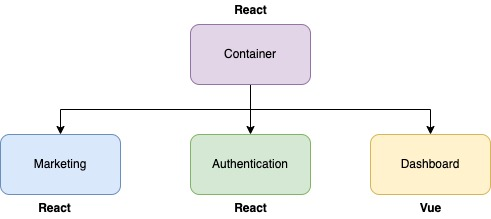

# Microfrontends with module federation

## The projects running on following port

- 1] Container app runs on 8080 port
- 2] Marketing app runs on 8081 port
- 3] Auth app runs on 8082 port
- 4] Dashboard app runs on 8083 port

> [Do you want to learn Microfrontends with React?]</a> (English). **All credits to the original author, [Stephen Grider]**

[Do you want to learn Microfrontends with React?]: <https://www.udemy.com/course/microfrontend-course>

[Stephen Grider]: <https://twitter.com/ste_grider>
